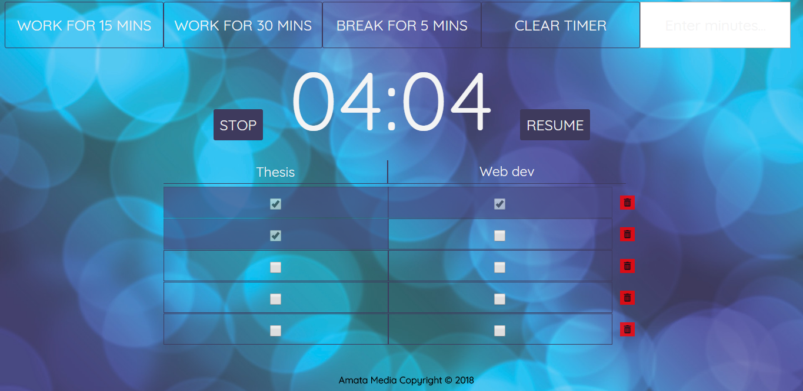

# Productivity Web Application

This is a responsive frontend web application influenced by the Pomodoro technique for efficient time management which utilizes a timer to enable the user to keep track of two activities.

The top part of the web application contains four buttons: 3 of which are used to countdown from a specific time (in minutes) and the fourth button is used to clear the timer. In addition, there is an input field where the user can enter the number of minutes to countdown from.

Below the row of buttons and before the row that contains the fields "Edit Activity Name", is where the countdown timer will be displayed when the user clicks or enters the number of minutes to be counted down.

The user can edit the default "Edit Activity Name" field by simply clicking on any of the letters to the activity he/she wants to track. The "Add Row" button below adds a row containing two items, one for each activity. Each item contains a checkbox which when checked, changes the background of the parent element of that item. This is used to signify that the particular activity slot has been completed when the corresponding timer has elapsed.

A delete button is appended to each row added, this is used to delete the corresponding row. A maximum of 5 rows can be created to track the user's activities. After the fifth row is created, the "Add Row" button disappears. It is made visible again when any rows are deleted.
___

## Technologies Used
HTML5, CSS3 were used to develop this web application. JavaScript was used to program the user interactions. No frameworks were used for this application.
___

## Screenshots
The figures below are screenshots of the web application:

---

